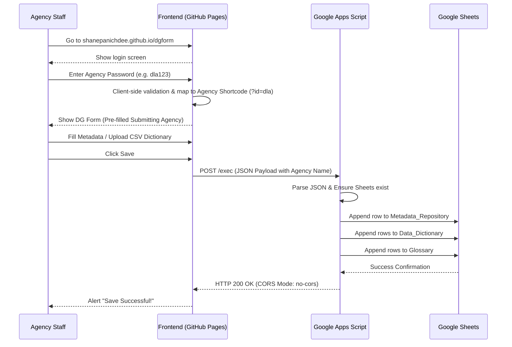

# Data Governance Form - System Overview (DG Form)

## 📌 1. Project Overview
Project "DG Form" (Data Governance & Metadata Documentation Form) is a Serverless Web Application designed to collect, validate, and store Data Dictionaries, Business Glossaries, and Metadata from various government agencies into centralized Google Sheets.

## ⚙️ 2. Core Technologies (Tech Stack)
- **Frontend:** HTML5, Vanilla JavaScript, Bootstrap 5 (CSS framework)
- **Libraries:** PapaParse (for CSV parsing)
- **Hosting / Deployment:** GitHub Pages (Serverless, Free, High Availability)
- **Backend / API:** Google Apps Script (GAS)
- **Database:** Google Sheets

## 🏗️ 3. System Architecture & Data Flow
The system uses a completely serverless architecture, passing lightweight JSON payloads directly from the client's browser to Google's infrastructure.

## 🔒 4. Authentication & Routing Mechanism
Since GitHub Pages cannot run backend code (Node.js/PHP), the authentication is purely **Client-Side Validation** designed to act as a Router rather than a secure vault.

### Password Mapping Table:
| Agency | Username | Password | Redirect URL | Google Sheet Target |
| :--- | :--- | :--- | :--- | :--- |
| **Admin** | `admin` | `admin@123` | `/?token=...` | Configurable in UI |
| **DLA** | `admin` | `dla123` | `/?id=dla` | DLA Specific Sheet |
| **DIW** | `admin` | `diw123` | `/?id=diw` | DIW Specific Sheet |

**How it works:**
1. User types `dla123` on `login.html`.
2. Script intercepts the submit, checks the hardcoded `validPasswords` array.
3. If it matches, the script redirects to `index.html?id=dla`.
4. `index.html`'s `loadConfig()` function reads the `?id=` parameter.
5. It looks up the `shortcodes` dictionary in `index.html`.
6. It automatically injects the Agency Name into the locked input field and invisibly sets the `scriptUrl` (Google Apps Script Web App URL) in the background.
